# SmartCart

## Table of Contents

-   [Introduction](#introduction)
-   [Project Components](#project-components)
-   [How to Run](#how-to-run)
-   [Screenshots](#screenshots)
-   [Team Members and Roles](#team-members-and-roles)
-   [Pending Implementation and To-Do's](#pending-implementation-and-to-dos) 

## Introduction

Welcome to the **SmartCart** project, an innovative application designed to tackle the issue of excessive consumerism in online shopping. Our goal is to assist users in making more responsible and sustainable purchasing decisions, and to increase awareness about the impact of their consumption on the environment and society.

### Key Features

SmartCart includes a variety of features:

- **Purchase Need Analysis**: The application uses sophisticated algorithms to analyze users' buying needs based on their shopping history, preferences, and consumption trends.
- **Smart Recommendations**: During the checkout process in a marketplace, SmartCart analyzes the shopping list and provides recommendations or warnings about items that may not align with the actual needs of the users.
- **Integration with Online Shopping Platforms**: This feature allows for real-time analysis and recommendations during the checkout process without disrupting the user experience.
- **Contribution to Sustainable Shopping**: By encouraging wiser shopping decisions, SmartCart aims to reduce excessive consumerism.

## Project Components

The project consists of two main components:

### 1. SmartCart App

- **User Needs Input**: Users can input their shopping needs.
- **Shopping History**: Automatic saving of shopping history based on marketplace transaction history.
- **Need Checklist**: Automated or manual checklist to track whether the shopping needs have been met.

### 2. Dummy Marketplace App

- **App Initialization**: Users start by opening the app.
- **Mandatory Needs Input**: If the needs are not filled in the SmartCart app, users are prompted to do so.
- **Shopping and Checkout Process**: Users can shop and proceed to checkout.
- **Warnings for Unnecessary Items**: Warnings are displayed for items that may not be necessary.
- **Dismissal of Warnings**: Warnings disappear one by one after review.
- **Final Checkout**: Users can proceed to the final checkout after addressing the warnings.

## How to Run

### Prerequisites

Before running the projects, ensure that you have the following installed:

- Flutter SDK
- Dart SDK
- An IDE (Android Studio/IntelliJ, VSCode, etc.)
- A suitable emulator or physical device

### Getting Started

First, clone the repository to your local machine:
```bash
git clone https://github.com/your-username/smartcart.git
```
Navigate into the cloned directory before proceeding with the following steps.

### Running the SmartCart App

To run the SmartCart application, follow these steps:

1. Navigate to the SmartCart App project directory:
```bash
cd smart_cart
```

2. Get all the dependencies:
```bash
flutter pub get
```

3. Ensure your emulator is running, or a device is connected and then execute:
```bash
flutter run
```

### Running the Marketplace App

To run the Marketplace application, you will follow a similar set of steps:

1. Navigate to the Marketplace App project directory:
```bash
cd dummy_marketplace
```

2. Install all the necessary dependencies:
```bash
flutter pub get
```

3. Start your emulator or connect your device and then run the app:
```bash
flutter run
```

### Debug Mode

Note that both projects are currently in debug mode. This mode is for development purposes and provides hot reload but does not reflect the performance you would expect from a release build.

## Screenshots

### SmartCart App

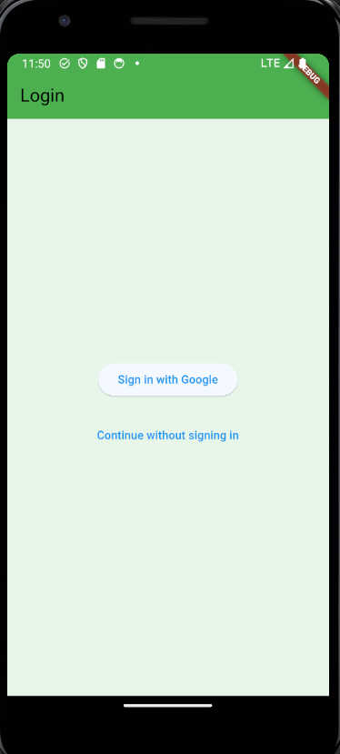

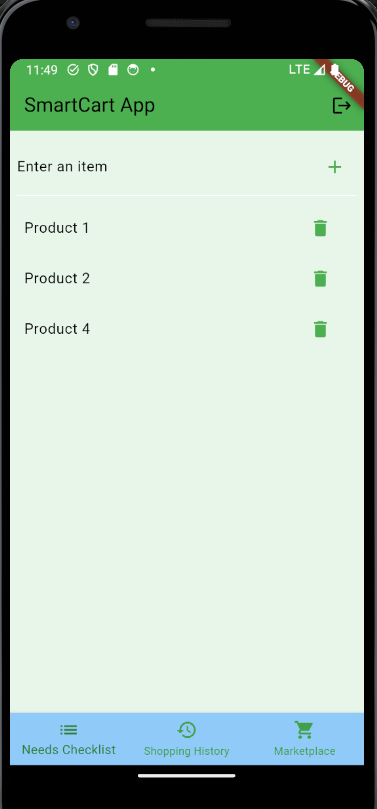

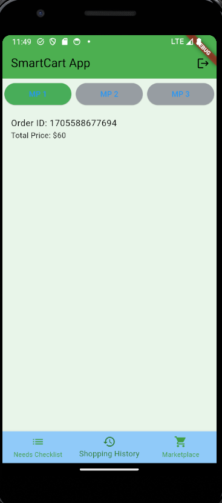

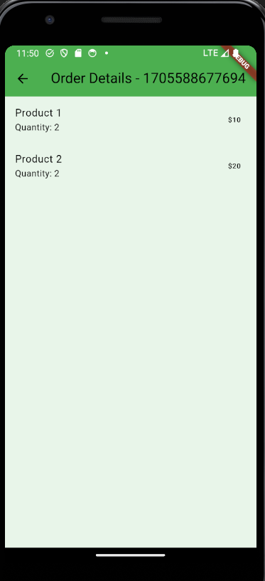

### Dummy Marketplace App

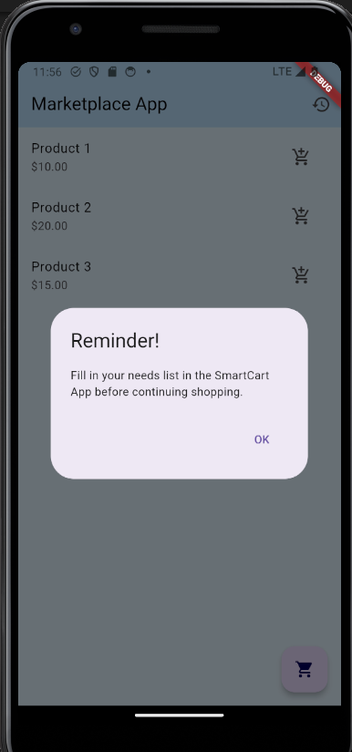

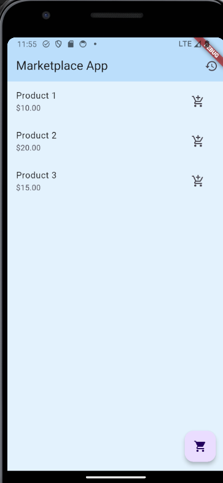

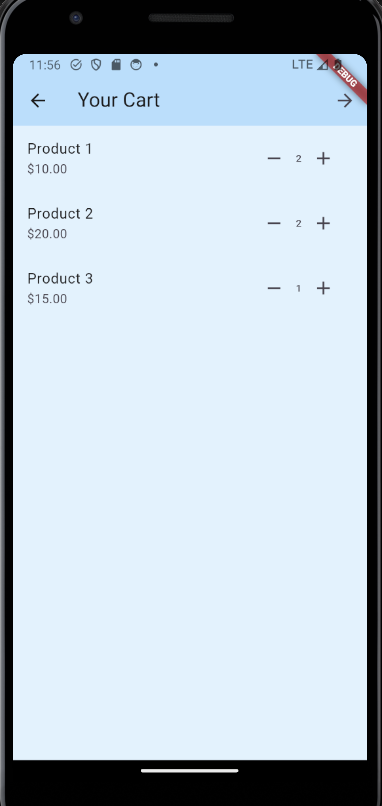

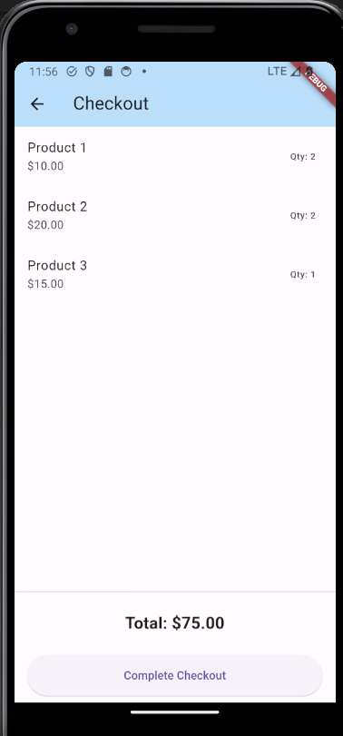

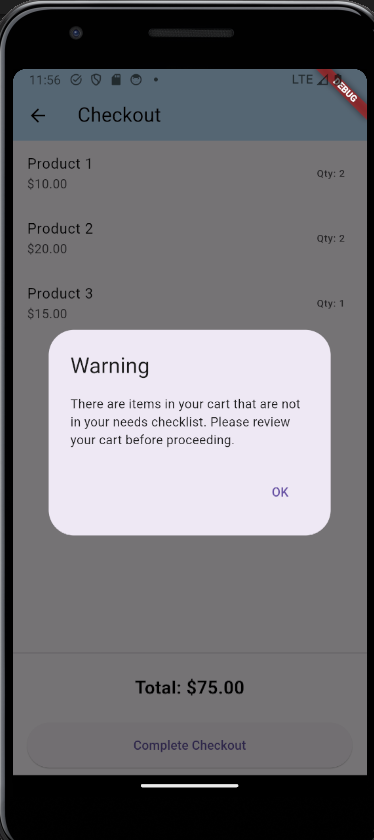

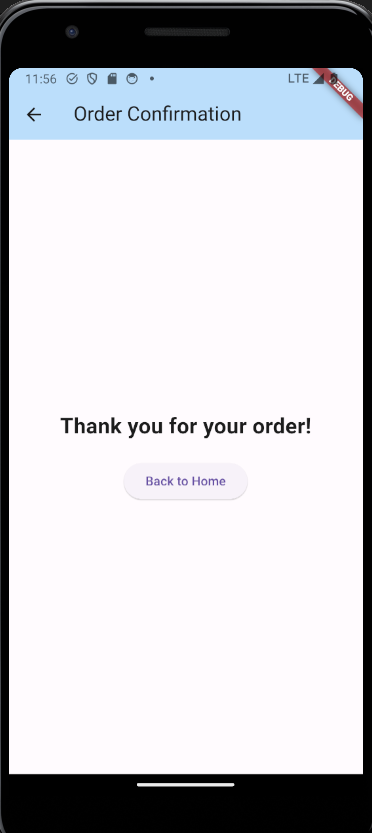

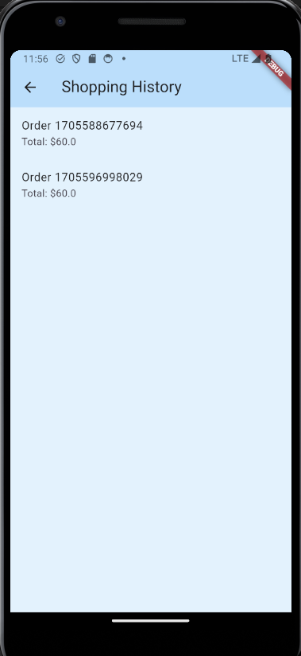

## Team Members and Roles

**Team Name: masih waras**

**GDSC Chapter: HF24- 9**

| **Role** |       **Name**           |
| :------: | :-------------------:    |
|  Hacker  |  Novelya Putri Ramadhani |
|  Hustler |  Nabila Shikoofa Muida   |
|  Hipster |  Diana Tri Handayani     |

## Pending Implementation and To-Do's

There are a few areas that are still under development for this project: